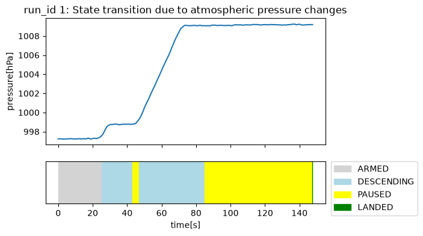
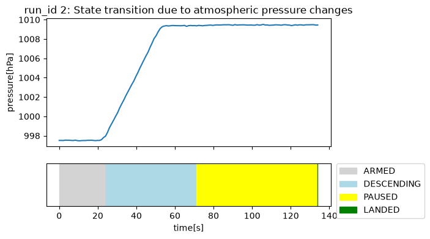

# CanSat Indoor Data Logger


## README English version

README English: [README.md](./README.md)

---

Wio Terminalと気圧センサーを使用し、降下・一時停止・着地の検知とデータ保全をエレベーターを用いて地上検証するCanSatモデルです。

実機CanSatのような屋外での打ち上げ・落下試験ではなく、屋内で再現可能なエレベーター移動を利用して、センサー値の取得、状態遷移、データ保全の実装と、実験後のデータの可視化・検証をしています。

本リポジトリは現在 **Phase 1.0** です。気圧による状態判定、SDカードへのログ保存、LCD表示、実環境でのフィールドテストと可視化までを対象としています。

---

## 本CanSatモデルで行っていること

対象マイコンをCanSatや小型探査機に見立て、センサー値から機体の状態を判断し、後から検証できる形でデータを保存します。

具体的には、次のことを行っています。

- 気圧変化から「降下中」と「静止中」を区別できること
- 途中階での停止を、着地と即断せず一時停止として扱えること
- 一定時間の気圧安定から着地を判定できること
- センサーデータと判定状態をSDカードへ継続的に保存できること
- 複数回の計測を同じCSV内で識別できること
- 実験後にPythonで気圧変化と状態遷移を可視化できること

---

## システム構成

### ハードウェア

| 機器 | 用途 |
| --- | --- |
| Seeed Studio Wio Terminal | 制御、ボタン入力、LCD表示、SDカード記録 |
| BMP280気圧センサー | 気圧の取得 |
| microSDカード | CSVログの保存 |
| Wio Terminal用バッテリーベース | 移動中の電源供給 |

### ソフトウェア

| 領域 | 使用技術 |
| --- | --- |
| ファームウェア | C++ / Arduino Framework |
| ビルド環境 | PlatformIO |
| 対象ボード | Seeed Wio Terminal |
| センサー制御 | Adafruit BMP280 Library |
| ストレージ | Seeed Arduino FS / Seeed SD |
| LCD | Seeed Arduino LCD / TFT_eSPI |
| 実験データ解析 | Python / pandas / matplotlib / Visual Studio Code(Jupyter Notebook拡張機能) |

---

## 処理フロー

起動時にBMP280とSDカードを初期化し、SDカード上の既存ログから次の計測IDを求めます。その後は約1秒間隔で気圧を取得し、各閾値に基づいて降下や着地を判定します。

```text
電源投入
   |
   +-- BMP280初期化
   +-- SDカード初期化
   +-- data.csvの準備
   +-- 次のrun_idを取得
   |
   v
 IDLE
   |
   | Cボタン押下
   v
 ARMED
   |
   | アーム時より気圧が0.3 hPa超上昇
   v
 DESCENDING
   |
   | 移動平均との差が±0.05 hPa未満の状態が5サンプル
   v
 PAUSED
   |\
   | \ 気圧変化を再検出
   |  +--------------------------> DESCENDING
   |
   | 安定状態が60サンプル
   v
 LANDED
   |
   | LCDに着地を表示し、5秒後に自動復帰
   v
 IDLE
```

エレベーターで下降すると高度が下がり、気圧は上昇します。そのため、降下開始はアーム時の気圧に対するプラスの変化で検出します。

---

## 状態遷移

| 状態 | 内容 | SD記録 | Cボタンの動作 |
| --- | --- | --- | --- |
| `IDLE` | 待機状態 | なし | `ARMED`へ移行 |
| `ARMED` | 降下開始を監視 | あり | `IDLE`へ戻る |
| `DESCENDING` | 降下を検出済み | あり | 計測を中止して`IDLE`へ戻る |
| `PAUSED` | 降下途中または到着後の気圧安定を監視 | あり | 計測を中止して`IDLE`へ戻る |
| `LANDED` | 着地判定済み | あり | 操作なし。自動的に`IDLE`へ戻る |

`IDLE`のみSDカードへ記録していません。これは、バッテリーとSDカード容量を節約する目的に加え、Cボタン押下による`ARMED`への移行を計測開始の明示的なトリガーとするためです。

### 判定パラメーター

| パラメーター | 現在値 | 用途 |
| --- | ---: | --- |
| `DESCENT_THRESHOLD_HPA` | 0.3 hPa | 降下開始・再開の検知 |
| 安定判定幅 | ±0.05 hPa未満 | 現在値と移動平均との差による安定判定 |
| `PAUSE_COUNT` | 5サンプル | `DESCENDING`から`PAUSED`への移行 |
| `LAND_COUNT` | 60サンプル | `PAUSED`から`LANDED`への移行 |
| `MOVING_AVG_SIZE` | 10サンプル | 判定用移動平均 |
| 測定間隔 | 約1秒 | センサー取得、記録、LCD更新 |

降下開始の判定では、緩やかな気圧変化も検出できるよう、`ARMED`へ移行した時点の気圧を固定の基準値として使用しています。降下中の安定判定には直近10サンプルの移動平均を使用します。

#### 各閾値の選定根拠

いずれもまず一般的な物理・経験則から仮の値を算出し、フィールドテストで調整しました。

- **降下判定 0.3 hPa**:地表付近では10m下降するごとに気圧はおよそ1.2hPa上昇する。住宅の1階あたりの高さを約3m、商業ビルを約4mとして中間の3.5mを仮定すると、1階あたりの気圧変化はおよそ0.4hPa。センサーノイズを考慮し、やや低めの0.3hPaを閾値とした。
- **一時停止判定 5サンプル(約5秒)**:一般的なエレベーターの扉開閉に要する時間はおよそ2秒、乗り降りには10〜30秒程度を要すると想定。5秒程度の気圧安定が続けば、少なくとも移動中の一時停止とみなせると判断した。
- **着地判定 60サンプル(約60秒)**:上記より最長の途中停止時間が37秒と予測したため、誤判定を避けるためやや余裕を持たせた60秒とした。
- **安定判定幅 ±0.05 hPa**:使用したBMP280センサーの気圧誤差がおよそ±0.1hPaであるため、ノイズと実変化を区別できるよう、誤差より厳しい0.05hPaを閾値とした。

---

## SDカードへのログ保存

ログはSDカード直下の `data.csv` に追記されます。ファイルが存在しない場合は、起動時にヘッダーを作成します。

```csv
run_id,seq,timestamp_ms,pressure_hpa,baseline_hpa,state
1,0,33597,997.23,997.23,ARMED
1,1,34660,997.25,997.23,ARMED
```

| 列 | 内容 |
| --- | --- |
| `run_id` | 計測セッションの識別番号 |
| `seq` | セッション内の連番 |
| `timestamp_ms` | Wio Terminal起動後の経過時間（ミリ秒） |
| `pressure_hpa` | BMP280から取得した気圧 |
| `baseline_hpa` | 直近10サンプルの移動平均 |
| `state` | 記録時点の状態 |

起動時および計測開始時にCSVの最終行を確認し、最後の `run_id` に1を加えた値を次のセッションのIDとしました。各レコードは追記後にファイルを閉じるため、予期しない電源断が発生した場合も、それ以前に書き込み済みのデータを保持しやすくしています。

---

## LCD表示

計測中はWio TerminalのLCDへ次の情報を表示します。

- 現在の状態
- 現在の気圧
- `run_id`
- `seq`
- 安定判定カウンター

着地判定後は `*** LANDED ***` を表示し、5秒後に待機状態へ戻ります。PCへ接続しなくても、実験場所で記録状況を確認できます。

---

## 実験結果

展望台からのエレベーターでの下降によるフィールドテストを実施し、2回分のデータを取得しました。

実験データ: [`ref/data_phase1.0.csv`](./ref/data_phase1.0.csv)

| 項目 | run_id 1 | run_id 2 |
| --- | ---: | ---: |
| レコード数 | 142 | 129 |
| 記録時間 | 約147.6秒 | 約134.0秒 |
| 最低気圧 | 997.22 hPa | 997.47 hPa |
| 最高気圧 | 1009.24 hPa | 1009.51 hPa |
| 気圧変化幅 | 12.02 hPa | 12.04 hPa |
| 最終状態 | `LANDED` | `LANDED` |

run_id 1では、短い気圧安定区間で一度 `PAUSED`へ遷移した後、気圧変化の再検出によって`DESCENDING`へ再遷移しました。その後、最終停止を経て`LANDED`へ到達しています。途中停止を即座に着地と判定しないための状態遷移が、実データ上でも確認できました。

```text
run_id 1: ARMED → DESCENDING → PAUSED → DESCENDING → PAUSED → LANDED
run_id 2: ARMED → DESCENDING → PAUSED → LANDED
```

### 可視化結果

気圧の時系列変化と状態遷移を、pandasとmatplotlibを使用して可視化しています。

#### run_id 1



#### run_id 2



解析用Notebook: [`ref/cansat_data_phase1.ipynb`](./ref/cansat_data_phase1.ipynb )

---

## 設計上のポイント

### 1. 段階的な検証によるパラメータ調整

フィールドテスト前に自宅アパート、駅ビルの階段を利用して事前検証を行いました。自宅アパートの階段(往復10回程度)ではコード調整・確認を、駅ビル3F相当の階段(2回)では自宅より高い位置・より緩やかな階段という異なる条件下での動作確認を行っています。

検証の結果、徒歩による緩やかな気圧変化では、移動平均との差が固定閾値(0.3hPa)に届かず降下を検知できないケースが見られました。そのため、降下判定にはARMED時点の気圧を固定基準値として使用し、緩やかな変化でも検知できるよう調整しました。一方、一時停止や着地の判定には移動平均を使用し、短時間のセンサーノイズの影響を抑えています。

### 2. 実環境調査に基づく一時停止状態の導入

当初、対象エレベーターは直通(途中階停止なし)と想定していましたが、実験計画を進める中で確認したところ、途中階で停止する可能性があることが分かりました。また、実際のCanSatでも気流の乱れ等により地上到達前でも気圧変化が緩やかになる場面があることも踏まえ、「気圧安定=即着地」と判定しない`PAUSED`状態を導入しました。結果として、フィールドテストのrun_id 1では実際に途中停止を検知し、run_id 2では停止なしで着地するという異なる挙動を、同一ロジックで正しく判定できることを確認しました。

### 3. 電源運用に応じたrun_id管理方式の見直し

当初はWio Terminal起動のたびにrun_idを1にする設計でしたが、バッテリー節約のためテスト間で電源をOFFにする運用が必要と分かり、この設計では常にrun_id=1に固定されてしまうことに気づきました。そのため、SDカード上の記録から最終run_idを読み取り、次の値を決定する方式に変更しています。

### 4. 自動判定と手動中止の併用

降下開始と着地はセンサー値から自動判定します。一方、実験中の誤操作や想定外の挙動に対応できるよう、Cボタンでアーム解除や計測中止ができます。

### 5. 判定根拠を含むログ

センサーから取得した値だけでなく、判定に使用した移動平均と状態を同じ行へ保存します。これにより、実験後に状態遷移の妥当性を確認できます。

---

## ファイル構成

```text
.
├── platformio.ini                         # PlatformIO設定、依存ライブラリ
├── src/
│   └── main.cpp                           # センサー取得、状態遷移、SD記録、LCD表示
└── ref/
    ├── data_phase1.0.csv				   # Phase 1.0の実験ログ
    ├── cansat_data_phase1.ipynb           # 実験データ可視化Notebook
    ├── run_id01.png                       # run_id 1の可視化結果
    └── run_id02.png                       # run_id 2の可視化結果
```

---

## ビルドと書き込み

### 前提条件

- PlatformIO Core
- Wio Terminal
- BMP280気圧センサー
- FAT32形式のmicroSDカード(最大16GB)

### ビルド

```bash
pio run
```

### Wio Terminalへの書き込み

Wio TerminalをブートローダーモードにしてPCへ接続し、次を実行します。

```bash
pio run --target upload
```

### デバッグ出力

シリアルデバッグを使用する場合は、`src/main.cpp`の次の定義を有効にします。

```cpp
#define DEV_MODE
```

有効時のシリアル通信速度は115200 bpsです。通常ビルドではデバッグ出力を無効にしています。

---

## 操作方法

1. BMP280とmicroSDカードを接続し、Wio Terminalの電源を入れます。
2. 初期化後、LCDが`IDLE`状態になっていることを確認します。
3. 計測開始前にWio TerminalのCボタンを押し、`ARMED`へ移行します。
4. 降下中は自動的に`DESCENDING`へ移行し、気圧と状態を記録します。
5. 気圧が安定した状態が5秒続くと`PAUSED`へ移行します。その後降下を検知すると再び`DESCENDING`に移行します。
6. `PAUSED`(気圧安定)の状態が約60秒安定すると`LANDED`へ移行します。
7. 実験終了後、microSDカードの `data.csv` をPCへコピーして解析を行います。

`ARMED`、`DESCENDING`、`PAUSED`の途中でCボタンを押すと、計測を中止して`IDLE`へ戻せます。

---

## 既知の制約

- 現在はオフライン記録専用であり、Wi-Fi送信や通信断後の自動再送は未実装です。
- 気圧閾値とサンプル数は今回のエレベーター実験を前提とした経験的な値です。使用場所や気象条件に応じた再調整が必要です。
- `MOVING_AVG_SIZE`(移動平均のサンプル数)と`PAUSE_COUNT`(一時停止判定のサンプル数)は独立したパラメータですが、移動平均の窓を広げると安定判定までの遅延が増えるため、実質的に相互作用している可能性があります。フィールドテストでは実害は確認していませんが、定量的な検証は未実施です。
- 安定判定閾値(0.05hPa)は現状コード内に直接記述されており、他の閾値のように`#define`定数化されていません。
- 気圧のみで判定しているため、機体の加速度、姿勢、振動は判定に使用していません。
- `timestamp_ms`は絶対日時ではなく、Wio Terminal起動後の経過時間です。
- LCD、気圧センサー、SDカードなどの初期化処理に失敗した場合の対応については未実装です。
- 可視化用に作成したコード(cansat_data_phase1.ipynb)は、CanSatのコードとは別のディレクトリで作成したため、このリポジトリ上で再実行する際はパスなどの調整が必要です。

---

## 今後の発展

Phase 1.0を基礎として、次の拡張を検討しています。

- Wi-Fi通信の追加
- 通信断中のSDカードへのバッファリング
- 通信復帰後の未送信データ自動再送
- 送達確認と再送制御によるデータロス対策
- 加速度センサーを組み合わせた降下・着地判定の補強
- 9軸IMUによる姿勢計測とセンサーフュージョン
- GPSを使用した屋外CanSatへの発展
- ログ書き込み失敗時の再試行とエラー表示
- 状態遷移ロジックの単体テスト
- `MOVING_AVG_SIZE`を5サンプルに戻した場合の再検証(`PAUSE_COUNT`との相互作用の確認)
- 安定判定閾値の`#define`定数化
- 一部処理のRust移植と組込みRust環境の検証

将来機能は段階的に追加し、センサー処理、状態管理、データ保全、通信処理を分離した構成への発展を目指します。
